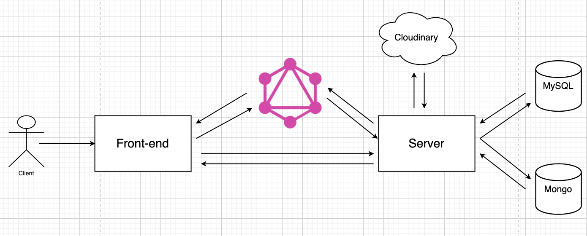
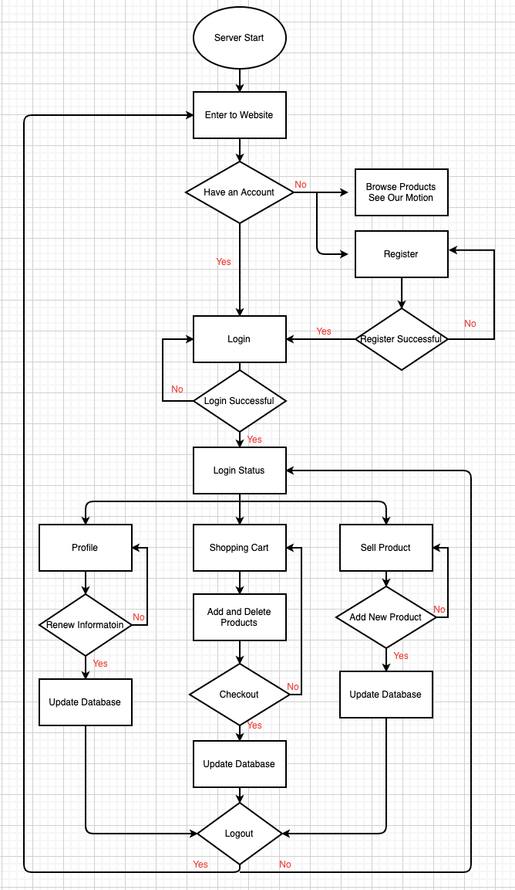

# Moving_Sale_E-Shop

> Cooperated with teammate to develop and deployed web application on AWS EC2 by using Node.js Express, Vue.js, MongoDB Atlas, AWS RDS, Cloudinary and GraphQL API.
<p align="center"></p>
<a href="http://ec2-54-219-155-154.us-west-1.compute.amazonaws.com:3000/home">To see the app in action</a>

---

## The Database Schema
### MySQL
```sql
CREATE TABLE user(
  user_id VARCHAR(40) NOT NULL CHECK (user_id <> ''),
  userName VARCHAR(40) NOT NULL CHECK (userName <> ''),
  account VARCHAR(40) NOT NULL CHECK (account <> ''),
  email VARCHAR(50) NOT NULL CHECK (email <> ''),
  pass VARCHAR(50) NOT NULL CHECK (pass <> ''),
  PRIMARY KEY (user_id)
);

CREATE TABLE product(
  product_id INT UNSIGNED NOT NULL AUTO_INCREMENT,
  productName VARCHAR(40) NOT NULL CHECK (productName <> ''),
  seller VARCHAR(40) NOT NULL DEFAULT 'Alison',
  price INT UNSIGNED NOT NULL CHECK (price >= 0),
  category VARCHAR(40) NOT NULL,
  boughtDate VARCHAR(40) NOT NULL,
  product_photo VARCHAR(150) NOT NULL CHECK (product_photo <> ''),
  look_like VARCHAR(150) NOT NULL CHECK (look_like <> ''),
  numberOfProduct INT NOT NULL CHECK (numberOfProduct >= 0),
  descript VARCHAR(200) NOT NULL,
  PRIMARY KEY (product_id)
);

CREATE TABLE history(
  history_id INT UNSIGNED NOT NULL AUTO_INCREMENT,
  price INT UNSIGNED NOT NULL,
  buyer VARCHAR(40) NOT NULL CHECK (buyer <> ''),
  seller VARCHAR(40) NOT NULL CHECK (seller <> ''),
  buy_at DATETIME NOT NULL DEFAULT CURRENT_TIMESTAMP,
  product_name VARCHAR(40) NOT NULL CHECK (product_name <> ''),
  num INT UNSIGNED NOT NULL,
  PRIMARY KEY (history_id)
);
```
---
### GraphQL
```graphql
type Product {
  productId:    ID!
  productName:  String!
  price:        Int!
  seller:       User!
  category:     String!
  boughtDate:   String!
  product_photo:String!
  look_like:    String!
  numberOfProduct: Int!
  descript:     String!
}

type User {
  userId:       ID!
  userName:     String
  account:      String!
  pass:         String!
  email:        String!
  products:     [Product]
  buyProducts:  [History]
}

type History {
  buyer:        String
  buy_at:       String
  num:          Int
  product_name: String
  price:        Int
}
```


---

## Architecuture
<p align="center"></p>

## Flow Chart
<p align="center"></p>

## Features

* Used node.js express as backend, Vue.js as frontend and integrated with MongoDB Atlas and AWS RDS.
* Used GraphQL to fetch and update data in database.
* Used local strategy of Passport.js for authentication and authorization.
* Implemented shopping cart by using LocalStorage and MySQL.

## Prerequisites

### 1. MySQL server start

Please start your MySQL server.
And then create database and tables which is mentioned above.
```sql
CREATE DATABASE project
```

### 2. Edit [database.js](database.js)
Change the host ip.

### 3. Key of Cloudinary and MongoDB Atlas
Create an .env file copy and paste the following lines inside

```
CLOUDINARY_CLOUD_NAME=xxxx
CLOUDINARY_KEY=xxxx
CLOUDINARY_SECRET=xxxx
DB_URL=xxxxx
```
---

## Run the program

Please run:

```shell
cd Moving_Sale_E-Shop
node index.js
```
---
## Major files
[index.js](index.js): All GET and POST <br>
[database.js](database.js): Connect with MySQL server<br>
[login.ejs](login.ejs): Page to login<br>
[register.ejs](register.ejs): Page to register as a member<br>
[profile.ejs](profile.ejs): Users' personal information<br>
[home.ejs](home.ejs): Home Page<br>
[about.ejs](about.ejs): Page of our self-introduction<br>
[product.ejs](product.ejs): Page of listing all selling goods<br>
[productDetail.ejs](productDetail.ejs): Detail of a specific product<br>
[add.ejs](add.ejs): Page to upload a new product<br>
[controllers/users.js](controllers/users.js): Logic part of login, logout and register<br>
[routes/users.js](routes/users.js): Route part of login, logout and register<br>
[resolvers.js](resolvers.js): Logic part of GraphQL<br>

